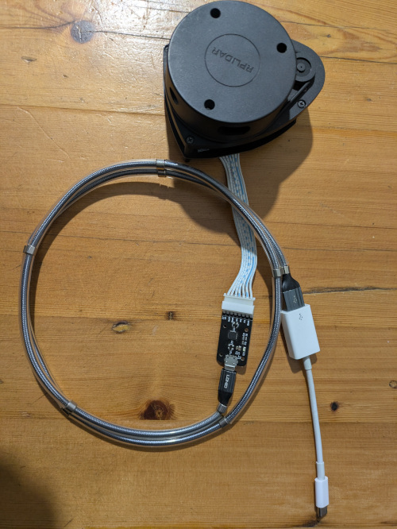
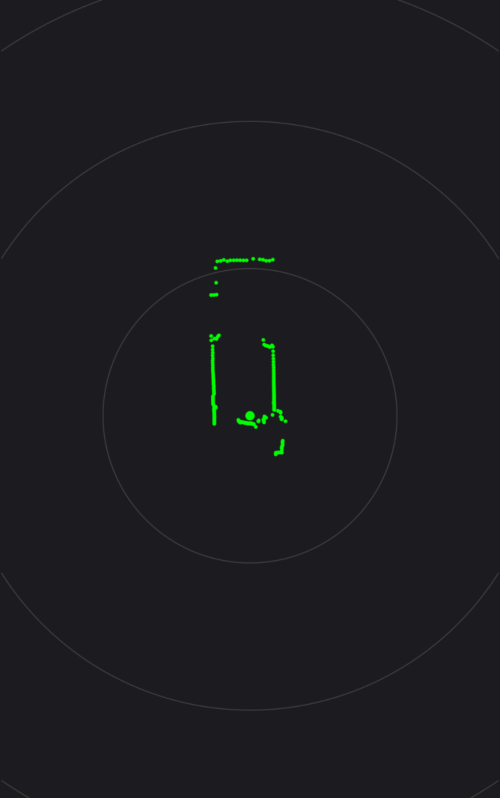

# Android RPLIDAR A1 Drivers & Real-Time Radar Map

## 🎯 Motivation & Backstory

> "I have been trying to get my LiDAR to display on my Android device for a while and finally got it right. This project won't change the world, but it has been a lot of fun trying to get this to work, and being able to walk around and see exactly how a LiDAR works in real-time is incredibly rewarding."

The goal wasn't just to write code, but to understand the mechanics of spatial hardware telemetry, tinker with high-frequency serial streaming, and create an entirely portable, battery-powered radar map tracker you can carry in your pocket.

Later this year, I hope to get this project doing SLAM, but I think I will need to upgrade to a better LiDAR like the Mid-360 made by Livox. It is a very affordable LiDAR option for my needs.

I hope this finds some usage somewhere. These RPLIDAR units are cheap and easy to find, so for a tinkerer like me, it's perfect. Different versions of Android present different challenges... keep at it.

<table border="0">
  <tr>
    <td></td>
    <td></td>
  </tr>
</table>

Check the video out int he images directory

## 🚀 Features

* **Native Streaming Core:** Low-latency C++ implementation via Android NDK/JNI to handle massive serial data payloads without locking or choking the JVM main thread.
* **Efficient Frame Batching:** C++ caches individual raw points during a physical $360^\circ$ revolution and shifts complete frame vectors to Kotlin only when the hardware `StartBit` flag triggers.
* **Custom Radar Map Canvas:** Custom Android `View` that converts raw Polar telemetry Data (Angle & Distance) into Cartesian $(X,Y)$ screen coordinates in real-time.
* **Interactive Pinch-to-Zoom:** Integration of `ScaleGestureDetector` allowing smooth scaling of the visual scanning range dynamically from 1.5 meters up to 15 meters.
* **Hardware-Matched Corrections:** Embedded configurations to align image orientations, including horizontal mirroring inversion adjustments and automatic DTR pin management to preserve device motor states.

---

### 📦 Prerequisites

* **Android Device:** Must explicitly support **USB Host Mode / USB-OTG (On-The-Go)**.
* **USB-OTG Cable/Adapter:** Required to physically bridge your phone's USB-C or Micro-USB port to the LiDAR's USB adapter board.
* **Android Studio:** Quail 2026.1.1 Patch 2 or newer recommended.
* **Android SDK:** 36
* **Android NDK & CMake:** Configured via the SDK Manager inside Android Studio for compiling the native C++ parsing library.
* **Physical Hardware:** An RPLIDAR A1 unit (A1M8 or similar) with its companion USB adapter board.

## ⚙️ System Architecture Flow

```text
  [ RPLIDAR A1 Sensor ] 
          │ (Raw Serial Stream via USB-OTG)
          ▼
  [ MainActivity.kt (usb-serial-for-android) ]
          │ (Direct Byte Array Forwarding)
          ▼
  [ native-lib.cpp (JNI/NDK Layer) ]  ◄── 7-Byte Header State Machine Validation
          │                               5-Byte Scan Packet Math Parser
          ▼ (Batched FloatArrays on New Scan Flag)
  [ RadarMapView.kt (Custom Canvas UI) ]
          │ (Polar -> Cartesian Trigonometric Mapping)
          ▼
  [ Live 2D Screen Render / Pinch Zoom Interaction ]
